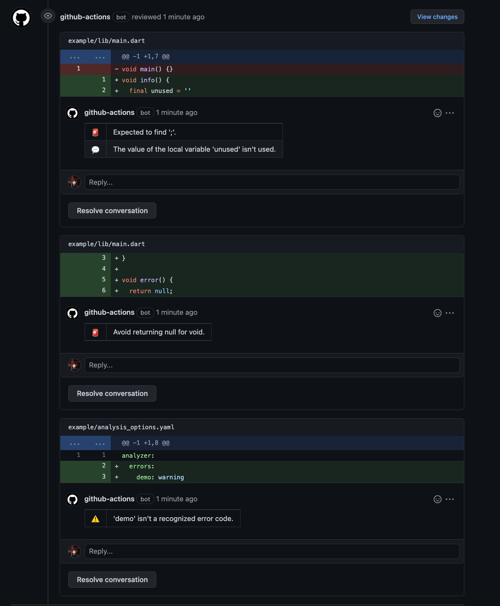

[](https://pub.dev/packages/elixir/)
[](https://pub.dev/packages/elixir/)
[](https://pub.dev/packages/elixir/score)

# Elixir

A command-line tool for commenting `dart analyze --format=machine $dir` results to GitHub PullRequest.



## Required

- Dart SDK version >=2.15.0 <3.0.0

## Usage

### GitHub Action

```yaml
name: "analyze"
on:
  pull_request:

jobs:
  dart:
    runs-on: ubuntu-latest
    steps:
      # https://github.com/actions/checkout
      - uses: actions/checkout@v3

      # https://github.com/dart-lang/setup-dart
      - uses: dart-lang/setup-dart@v1

      # https://github.com/blendthink/elixir
      - uses: blendthink/elixir@v2
        with:
          # (Optional) GITHUB_TOKEN or a `repo` scoped Personal Access Token (PAT).
          # Default: ${{ github.token }}
          token: ''

          # (Optional) Directory to run the `dart analyze`.
          # Default: ./
          dir: ''
```

### CLI

This package uses Git internally.

If you are using GitHub Actions, you can skip steps 1.

#### 1. Install Git

https://git-scm.com/book/en/v2/Getting-Started-Installing-Git

#### 2. Active package

```shell
dart pub global activate elixir
```

#### 3. Run package

```shell
cd {git-repository-path}
elixir run \
  --repo={repo} \
  --num={num} \
  --base={base} \
  --head={head} \
  --dir={dir}
```

## How to contribute

You should follow our [Code of Conduct].

See [Contributor Guide] for contributing conventions.

### Contributors

<table>
<tr>
    <td align="center" style="word-wrap: break-word; width: 150.0; height: 150.0">
        <a href=https://github.com/blendthink>
            
            <br />
            <sub style="font-size:14px"><b>blendthink</b></sub>
        </a>
    </td>
</tr>
</table>

<!-- Links -->
[Code of Conduct]: docs/CODE_OF_CONDUCT.md
[Contributor Guide]: docs/contributing/CONTRIBUTING.md
